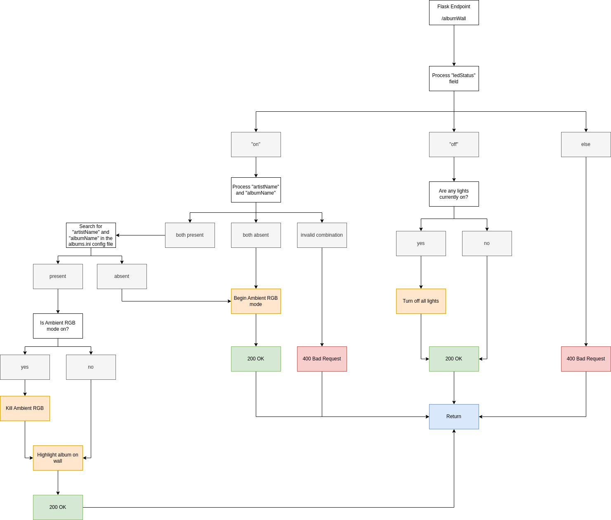

# Dynamic LED Album Display

This project is written for an ARM-based Raspberry Pi, which controls a WS2812B individually-addressable LED strip.

## Requirements
- ARM-based Raspberry Pi
- Individually-addressable LED strip (I used a WS2812B model)

**TODO:**
- Photo of albums on wall
- Photo of LED strips
- Photo of Raspberry Pi hooked up


## Basic Functionality
### Endpoint
When this flask endpoint is started, it will listen at `ip.of.pi:5000/albumWall`.

### Expected Format
The API expects a JSON payload. The following fields are valid, and will be handled:
```json
{
  "ledStatus"  : "ledStatusHere",
  "artistName" : "artistNameHere",
  "albumName"  : "albumNameHere"
}
```

For the given input to be valid:
- `ledStatus` must be present for each call, and should either be set to `"on"` or `"off"`
- `artistName` and `albumName` must either both be present, or both be absent.

If either of these conditions are not met, the API will respond with a `400 Bad Request` HTTP Response Code.

### Logic Behavior
The following diagram illustrates the behavior of this API:



## Deployment
This file can be deployed in a variety of ways. Personally, I created a systemd service:

1. Create a Systemd Service File:
```service
[Unit]
Description=Dynamic LED Album Wall
After=network.target

[Service]
ExecStart=/usr/bin/python3 /path/to/dynamic-led-album-wall/app.py
WorkingDirectory=/path/to/dynamic-led-album-wal
Restart=always
StandardOutput=syslog
StandardError=syslog
SyslogIdentifier=dynamic_led_album_wall

[Install]
WantedBy=multi-user.target
```

Place this service file into `/etc/systemd/system` directory. I named the file `albumwall.service`.
Execute `chmod 644 albumwall.service` for correct file permissions.

2. Reload Systemd and Start the Service
```bash
sudo systemctl daemon-reload
sudo systemctl start albumwall.service
sudo systemctl enable albumwall.service
```

3. Check the Service Status
```bash
sudo systemctl status albumwall.service
```

The output of this command should show something along these lines:
```bash
TODO
```
